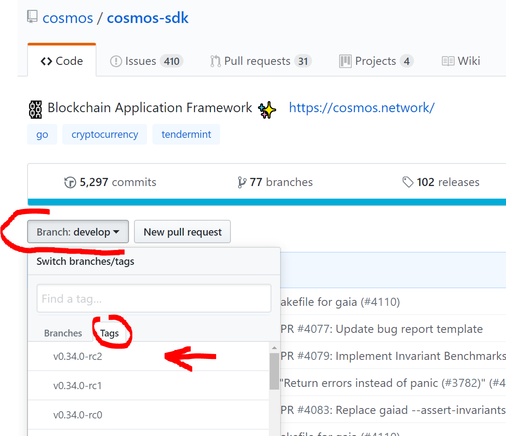

## Testnet experimentations

Testnet Genesis Files can be found [HERE](https://github.com/cosmos/testnets)

Validators Chat can be found in [HERE](https://riot.im/app/#/room/#cosmos-validators:matrix.org)

**Before you begin complete a [Essential Toolkit Installation](../Essential-Toolkit.md)**

### Quick Setup

Pull latest changes from develop branch

```
rm -r -f -v $HOME/.gaiad/config/addrbook.json $HOME/.gaiad/config/genesis.json

gaiad unsafe-reset-all

cd $GOPATH/src/github.com/cosmos/cosmos-sdk

git checkout master && git fetch --all && git pull

make clean && make install

gaiad init

```

### Advanced Setup

Although above setup is the simplest it might happen, that you want to participate in testnet after new change to master branch of [cosmos-sdk](https://github.com/cosmos/cosmos-sdk/) repository were already made in such case you will have to checkout by the latest tag otherwise you might experience later `ERROR: BlockSize.MaxBytes must be greater than 0. Got 0` or other error/issue after starting your node. Latest tag can be found by going to the Branch dropdown list in the [cosmos-sdk](https://github.com/cosmos/cosmos-sdk/) repository -> Tags panel -> first one is latest

To be absolutely sure it's recommended to verify on the [Validator Riot Chat](https://riot.im/app/#/room/#cosmos-validators:matrix.org) what is the latest tag version of the branch compatible with the testnet you want to participate in.




In our example latest version is `v0.34.0-rc2` but it might differ and you will have to change it in the following command:


```
rm -f -v $HOME/.gaiad/config/addrbook.json 
rm -f -v $HOME/.gaiad/config/genesis.json

gaiad unsafe-reset-all

cd $GOPATH/src/github.com/cosmos/cosmos-sdk

git checkout master
git fetch --all
git reset --hard v0.34.0
git pull

make clean 
make tools install

gaiad init

gaiad version --long
gaiacli version --long
```

### Genesis and initial setup

Copy genesis file, define seed nodes and set testnet property to latest testnet genesis file folder name

```
mkdir -p $HOME/.gaiad/config

testnet=gaia-13k
curl https://raw.githubusercontent.com/cosmos/testnets/master/$testnet/genesis.json > $HOME/.gaiad/config/genesis.json

nano ~/.gaiad/config/config.toml
```


Set `seeds` property according ot latest [Testnet Get Started Status List](https://github.com/cosmos/testnets#testnet-status) for example


```
seeds = "c24f496b951148697f8a24fd749786075c128f00@35.203.176.214:26656"
```

You can additionally set 'persistent_peers' property (if available) or ask on [Validator Riot Chat](https://riot.im/app/#/room/#cosmos-validators:matrix.org) to acquire one in case where your node does not want to sync new blocks and catch up with the network.


```
persistent_peers = "6ad4fb9dbb4665d109446a0bd42ca56babce4af5@52.28.230.137:26656,9b725f854a97e964f659b5ee2e3087a4eb7c9787@bity-testnet.cosmos-validators.com:26656" 
```

To save changes: **Ctrl+O, [Enter], Ctrl+X**

### Start a Full Node

```
mkdir -p $HOME/logs
nohup gaiad start &> $HOME/logs/gaiad.log &

#to preview loggs
tail -n 100 $HOME/logs/gaiad.log
```


To generate a bip32 seed you can use [Mnemonic Code Converter](https://iancoleman.io/bip39/) in order to persist a single key between different testnets. After clicking "GENERATE" button you will be presented with random 12 words you can use for the gaiacli keys add command, for example.

`bright flee spell nature unfold anchor govern envelope solve exercise flower fine`

Additionally you will have to set a minimum of 8 character password, for example: `12345678`

```
gaiacli keys add ValidatorKey --recover
```

You should expect output to resemble following

```
NAME:   TYPE:   ADDRESS:                                        PUBKEY:
ValidatorKey    local   cosmos1zmw9kwmldgxt8czg0csuqnr4j8syls5jn0njqm   cosmospub1addwnpepqg6l93rcut0j9fjjd93lr6u3rkppkwc6vtpd6mljxtshxnus8jwhg9uv30z
```

Use [Public Faucet](https://hubble.figment.network/chains/gaia-13003/faucet), use it to redeem testnet tokens to your address, in our case: 

`cosmos1zmw9kwmldgxt8czg0csuqnr4j8syls5jn0njqm`

As testnet explorer [Hubble](https://hubble.figment.network/chains/gaia-13003) can be used, a single atom is generally enough to join network as validator.

### Configure gaiacli


```
gaiacli config trust-node true

gaiacli config chain-id $(cat $HOME/.gaiad/config/genesis.json | jq -r '.chain_id')

gaiacli config node tcp://localhost:26657

```

Query balance and block height

```
gaiacli status | jq -r '.sync_info.latest_block_height'

gaiacli query account cosmos1zmw9kwmldgxt8czg0csuqnr4j8syls5jn0njqm

```

If you see message similar to 
```
ERROR: {"codespace":"sdk","code":9,"message":"account cosmos1zmw9kwmldgxt8czg0csuqnr4j8syls5jn0njqm does not exist"}
```

It means you might have not synced to the latest block yet and do not have any `muons` as per visible blockchain state.


Find out validator public key

```
cat $HOME/.gaiad/config/priv_validator_key.json | jq -r '.pub_key.value'
```

In our case output resulted in following response: `2fB28TlrPvwoddrlan7xUwp1635XSSmm/+RzVLLtsTA=`

To find out testnet coin denomination:

```
cat $HOME/.gaiad/config/genesis.json | jq -r '.app_state.accounts[0].original_vesting[0].denom'
```

### Create Validator Node

```
gaiacli tx staking create-validator \
  --amount=1000000muon \
  --pubkey=$(gaiad tendermint show-validator) \
  --moniker="YourValidatorName" \
  --chain-id=$(cat $HOME/.gaiad/config/genesis.json | jq -r '.chain_id') \
  --commission-rate="0.20" \
  --commission-max-rate="0.20" \
  --commission-max-change-rate="0.01" \
  --min-self-delegation="1" \
  --gas="auto" \
  --from=ValidatorKey \
  --fees=50000muon

```

Query validator info 

```
gaiacli query staking validator $(gaiacli keys show ValidatorKey --bech=val --output=json | jq -r '.address') --output=json
```

View your node in hubble

`https://hubble.figment.network/chains/<chain-id>`

Updating validators description

```
gaiacli tx staking edit-validator --moniker="Asmodat" \
  --website="https://github.com/BitySA/KnowledgeBase/blob/master/Staking-Services/Cosmos-Network/Cosmos-SDK/testnet-validator-setup.md" \
  --identity=1A1A1A1A1A1A1A1A \
  --details="To create your own testnet validator check my tutorial at https://github.com/BitySA/KnowledgeBase/blob/master/Staking-Services/Cosmos-Network/Cosmos-SDK/testnet-validator-setup.md" \
  --chain-id=$(cat $HOME/.gaiad/config/genesis.json | jq -r '.chain_id') \
  --gas="auto" \
  --from=ValidatorKey \
  --commission-rate="0.19" \
  --fees=50000muon
```

### Updating Validator Node

To perform update stop gaiad and 


```
sudo apt upgrade -y

rm -r -f -v $HOME/logs/gaiad.log
rm -r -f -v $HOME/.gaiad/data/
```

To check data directory and log size:

```
du -sh  $HOME/.gaiad/data
du -sh  $HOME/logs/gaiad.log
```

Now you are ready to perform installation as suggested by the [#advanced-setup](#advanced-setup). Once done start the node and send create-validator transaction as suggested by instructions above. You do not need to create new validator key.

### Validator Unjailing

It might happen that your testnet validator halted and got slashed, in such case you have to unjail your validator before it can start operating again. 

```
gaiacli tx slashing unjail \
  --from=ValidatorKey \
  --chain-id=$(cat $HOME/.gaiad/config/genesis.json | jq -r '.chain_id')
```

In case of slashing event Re-delegation might be required

```
gaiacli tx staking delegate cosmosvaloper1zmw9kwmldgxt8czg0csuqnr4j8syls5jkm88vg 1000000muon --from ValidatorKey --fees=50000muon
```

### Validator Service 
To maintain the node running even after restarts a dedicated service can be created to ensure that the process is alive.

Create new service file
```
nano /lib/systemd/system/cosmos.service
```

Append following lines

```
[Unit]
Description=Cosmos Network Validator Service
After=network.target

[Service]
Type=simple
ExecStart=/home/ubuntu/go/bin/gaiad start --home /home/ubuntu/.gaiad
Restart=always
RestartSec=5

[Install]
WantedBy=default.target
```

Enable service, start and check logs

```
systemctl enable cosmos
systemctl start cosmos
journalctl --unit=cosmos -n 100 --no-pager
```
